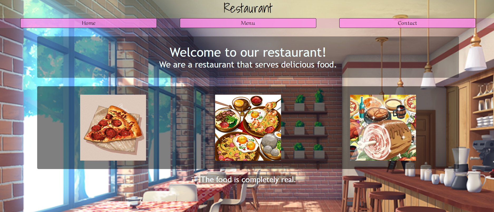

# Restaurant - Page
### A dynamic Restaurant-Page made using JS/CSS, an exercise for [TheOdinProject](theodinproject.com)
#### Click on the picture/the link below to try!

## [Click to open](https://redplusblue.github.io/Restaurant-Page/)

## Features:
1. Can access 3 different pages which are dynamically created by JavaScript.

## What I used/learned: 
1. CSS: `@keyframes` , `transform` 
2. JS: Webpack (bundling, dynamic html page creation, development server, `import` , `export`)
3. npm
